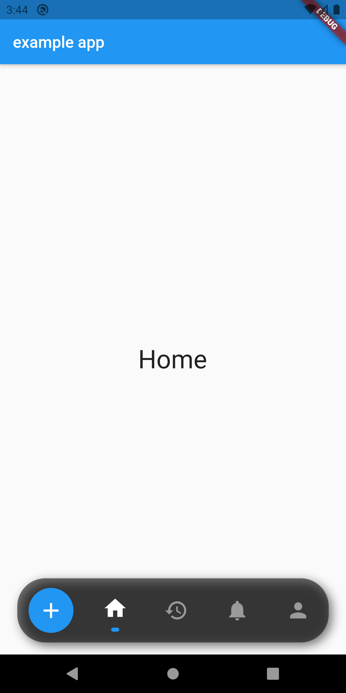
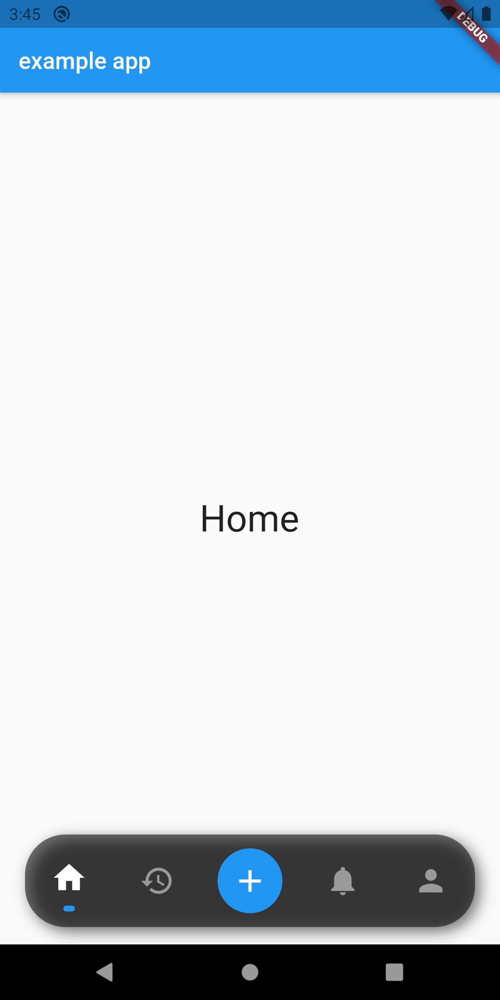
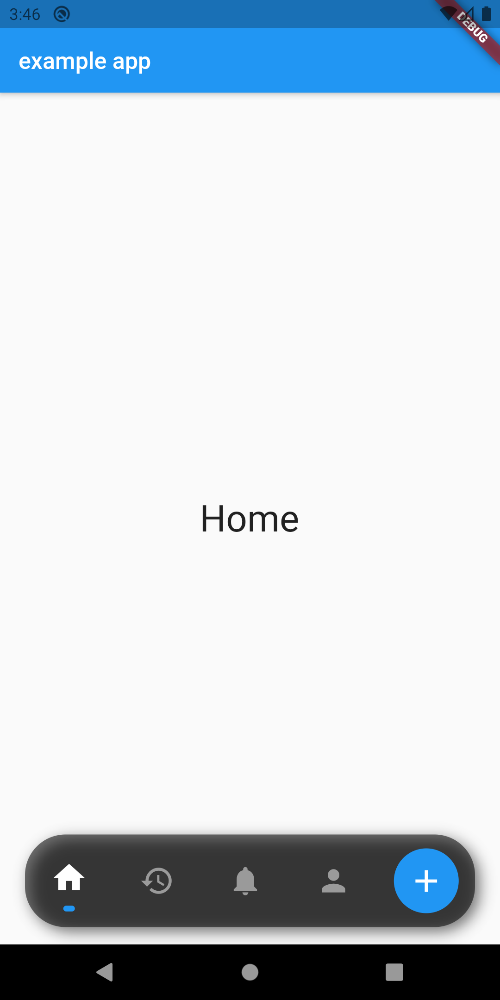
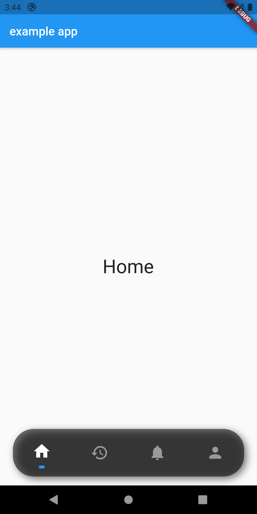

# Nav Bottom Bar

Simple and clear Bottom Navigation Bar

## Installation
Include `nav_bottom_bar` in your `pubspec.yaml` file:

```yaml
dependencies:
  flutter:
    sdk: flutter
  nav_bottom_bar: version
```

## Add this to use this library

```dart
import 'package:nav_bottom_bar/nav_bottom_bar.dart';

```

## Big Button at start



## Big Button at center



## Big Button at end



## No Big Button



